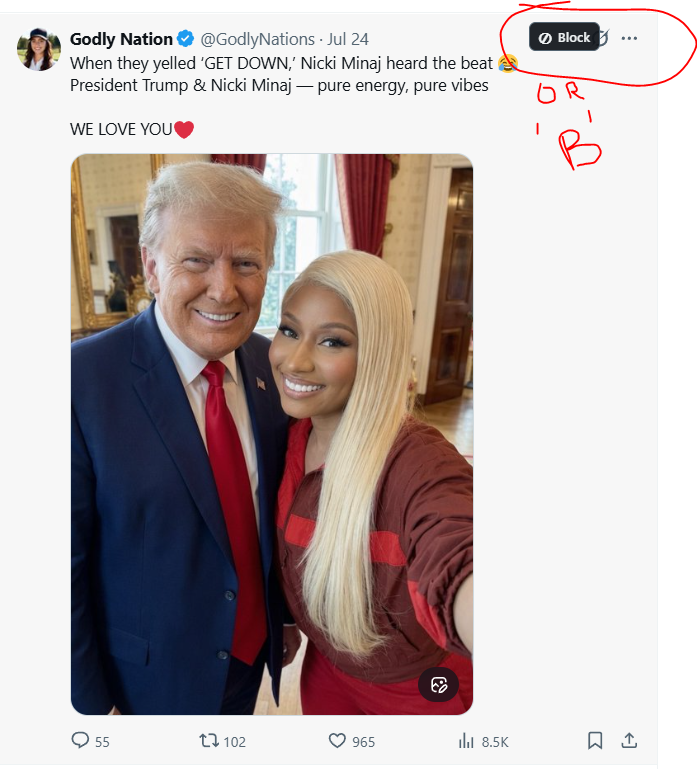

# XBlocker

**Block anyone on X with a single keypress.**

Normally, blocking an account means opening a menu, finding the block action, clicking it, and confirming. That friction adds up fast when you are cleaning up a busy thread.

XBlocker turns the whole process into one simple action:

> Hover over a post or reply and press `B`. Done.

No menus to hunt through. No repetitive clicking. Just fast, intentional control over who gets to occupy your timeline.

## See It in Action

Hover over any post to reveal the compact **Block** control, or simply press `B` while the post is under your pointer.

## Like or Unlike with One Key

Liking should be just as effortless as blocking:

> Hover over a post or reply and press `A`.

`A` is a true toggle. Press it once to like the post. Press it again to remove your like. You can react at the speed you scroll without aiming for the tiny heart button every time.

## Instant Video Controls

Hover over a post containing a video and press `M` to mute it. Press `M` again to turn the sound back on.

Press `F` to open that video fullscreen. When you are finished, press `Esc` to leave fullscreen as usual.

## Keyboard Shortcuts

| Key | Action |
| --- | --- |
| `A` | Like or unlike the hovered post |
| `B` | Block the hovered post's author |
| `F` | Open the hovered post's video fullscreen |
| `M` | Mute or unmute the hovered post's video |

## Why XBlocker?

- **One-key blocking:** Replace several clicks with a single `B`.
- **A serious time saver:** Moderate active threads at the speed you read them.
- **Stay in context:** Block an account without navigating away from the conversation.
- **Quick reactions:** Like or unlike posts without aiming for the heart button.
- **Instant video controls:** Toggle sound or enter fullscreen without finding tiny player buttons.
- **Typing protection:** Shortcuts are disabled while you are writing a post or using an input.
- **No account credentials:** XBlocker uses X's existing on-page controls.

## Install XBlocker

XBlocker is not in the Chrome Web Store yet, so you install it manually. You only need to do this once.

### 1. Download XBlocker

1. Click **[Download XBlocker](https://github.com/flyer1/XBlocker/archive/refs/heads/main.zip)**.
2. Your browser will download a file named `XBlocker-main.zip`, usually to your **Downloads** folder.
3. Unzip the file:
   - **Windows:** Right-click `XBlocker-main.zip`, choose **Extract All**, then click **Extract**.
   - **Mac:** Double-click `XBlocker-main.zip`.
4. You will now have a normal folder named `XBlocker-main`.
5. Move that folder somewhere you will not delete it, such as your **Documents** folder. Chrome or Edge needs to keep using these files.

### 2. Open Your Browser's Extensions Page

Use the instructions for your browser:

- **Google Chrome:** Type `chrome://extensions` into the address bar and press Enter.
- **Microsoft Edge:** Type `edge://extensions` into the address bar and press Enter.

### 3. Load XBlocker

1. Find the **Developer mode** switch on the extensions page and turn it on.
2. Click the **Load unpacked** button.
3. In the folder picker, find and select the unzipped `XBlocker-main` folder.
   - Select the folder itself, not the original `.zip` file.
   - You have the correct folder if it contains a file named `manifest.json`.
4. Click **Select Folder** on Windows or **Open** on Mac.
5. XBlocker should now appear on your extensions page.

### 4. Try It

1. Open [x.com](https://x.com) or refresh it if it was already open.
2. Hover over any post or reply.
3. A small **Block** button should appear near the post's menu button.
4. Try the shortcuts:
   - Press `A` to like or unlike the hovered post.
   - Press `M` to mute or unmute a video in the hovered post.
   - Press `F` to open a video in the hovered post fullscreen.
   - Press `B` only when you genuinely want to block that post's author.

That's it. XBlocker will load automatically whenever you open Chrome or Edge.

### Having Trouble?

- **"Manifest file is missing or unreadable":** You selected the wrong folder. Choose the unzipped `XBlocker-main` folder that directly contains `manifest.json`.
- **The Block button does not appear:** Make sure XBlocker is enabled on the extensions page, then refresh `x.com`.
- **XBlocker stopped working after you moved or deleted its folder:** Put the folder back, or use **Load unpacked** again and select its new location.
- **Your browser mentions Developer mode:** That is expected for an extension installed manually instead of through the browser's extension store.

## Use it

- Hover a post or reply and press `B` to block its author instantly.
- Hover a post or reply and press `A` to toggle its like on or off.
- Hover a post containing a video and press `M` to toggle its sound on or off.
- Hover a post containing a video and press `F` to open it fullscreen. Press `Esc` to exit.
- You can also click the compact **Block** button shown on a hovered reply.
- The shortcuts do nothing while you are typing in an input or post composer.

## Notes

XBlocker does not use your password or an unofficial account API. It activates X's existing controls after your keypress. X can change its page structure at any time, so selectors may occasionally need updating.
